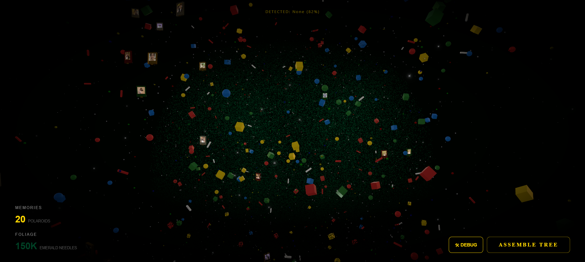
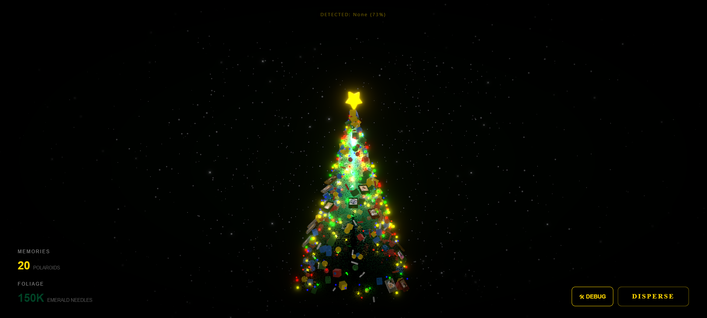

# 🎄 Grand Luxury Interactive 3D Christmas Tree

A high-fidelity interactive 3D Christmas Tree web experience built with **React**, **Three.js (React Three Fiber)**, and **AI-powered hand gesture recognition**.

This project is more than just a Christmas tree — it is an **interactive memory gallery**.
Tens of thousands of glowing particles, dynamic lights, floating Polaroid-style photos, and cinematic post-processing effects come together to form a luxurious 3D Christmas tree.

Users can control the tree using **hand gestures via a webcam**, including assembling, dispersing, rotating, tilting the view, and triggering special interactions — delivering a truly immersive, movie-like experience directly in the browser.

---

## 🙏 Credits

This project is based on and extended from:
👉 [https://github.com/moleculemmeng020425/christmas-tree](https://github.com/moleculemmeng020425/christmas-tree)

Special thanks to the original author for providing a solid foundation and inspiration for this project.

Significant extensions and enhancements were added, including:

* More AI hand gesture interaction
* Memory gallery system
* Advanced visual effects
* Custom gesture actions (e.g. Pointing Up)

---
## 📸 Preview




---

## ✨ Core Features

### 🎥 Cinematic Visual Quality
* Christmas tree composed of **150,000+ glowing particles**.
* Bloom, glow, and post-processing effects for a dreamy atmosphere.

### 🖼️ Interactive Memory Gallery
* Floating **Polaroid-style photos** attached to the tree.
* Each photo is an independent glowing object with double-sided rendering.

### 🤖 AI Hand Gesture Control (Webcam-Based)
No mouse or keyboard required — control everything with your hands:
* ✊ **Closed Fist** → Assemble the tree.
* 🖐 **Open Palm** → Disperse the tree into particles.
* ....

### ❄️ Rich Environmental Details
* Dynamic blinking Christmas lights.
* Falling golden and silver snowflakes.
* Randomly distributed gifts and candy decorations.

### ⚙️ Highly Customizable
* Easily replace photos with your own memories.
* Freely adjust the number of photos, particles, lights, and tree dimensions.

---

## 🛠️ Tech Stack

* **Framework:** React 18, Vite
* **3D Engine:** React Three Fiber (Three.js)
* **Utilities:** `@react-three/drei`, `maath`
* **Post Processing:** `@react-three/postprocessing`
* **AI / Computer Vision:** MediaPipe Tasks Vision (Google)

---

## 🚀 Getting Started

### 1️⃣ Prerequisites
Make sure you have **Node.js v18** or higher installed:
👉 [https://nodejs.org/](https://nodejs.org/)

### 2️⃣ Install Dependencies
From the project root directory, run:

```bash
npm install

```

### 3️⃣ Run the Development Server

```bash
npm run dev

```

Open your browser and navigate to: `http://localhost:5173`

---

## 🖼️ Customizing Your Photos

### 1️⃣ Prepare Your Images

Go to: `public/photos/`

**Required naming convention:**

* **Tree Top Image:** `top.jpg` (Displayed on the 3D star at the top of the tree).
* **Tree Body Photos:** `1.jpg`, `2.jpg`, `3.jpg`, ...

**Recommendations:**

* Square or 4:3 aspect ratio.
* File size under 500 KB per image for smooth performance.

### 2️⃣ Replace the Photos

Simply copy your own images into `public/photos/` and overwrite the existing files.
⚠️ **Keep the file names unchanged.**

### 3️⃣ Change the Number of Photos

If you add more (or fewer) photos, update the configuration:

Open: `src/App.tsx`

Find:

```typescript
// --- Dynamically generate photo list (top.jpg + 1.jpg to 31.jpg) ---
const TOTAL_NUMBERED_PHOTOS = 31; // 👈 Change this number

```

Set it to match your photo count.

---

## 🖐️ Gesture Control Guide

Make sure your webcam is enabled. A **DEBUG** button in the bottom-right corner allows you to preview camera input.

| Gesture | Action | Description |
| :--- | :--- | :--- |
| 🖐 **Open Palm** | **Disperse** | Tree explodes into thousands of floating particles and photos |
| ✊ **Closed Fist** | **Assemble** | All elements instantly fly back to form the structured Christmas tree |
| ☝️ **Pointing Up** | **Orbit Photos** | Photos detach to form a rotating circular ring around the tree |
| ✌️ **Victory** | **Spin & Scale** | Triggers a cinematic 360° rotation with dynamic scaling effects |
| 👍 **Thumbs Up** | **Updating** | Turn on music |
| 👎 **Thumbs Down** | **Updating** | Turn off music |
| 🤟 **Love You** | **Updating** | *Feature coming soon...* |

---

## ⚙️ Advanced Configuration

For deeper customization, modify the `CONFIG` object in `src/App.tsx`:

```typescript
const CONFIG = {
  colors: { ... }, // Tree, lights, borders
  counts: {
    foliage: 15000,   // Tree particles (lower for weak GPUs)
    ornaments: 300,   // Floating photos
    lights: 400       // Christmas lights
  },
  tree: {
    height: 22,
    radius: 9
  }
  // ...
};

```

---


## 📄 License

**MIT License**
Feel free to use, modify, and build upon this project for your own holiday experiences.

### 🎄 Merry Christmas & Happy Coding! ✨

---